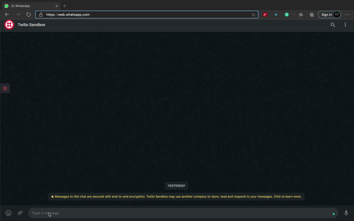

# whats-up

Querying on Whatsapp made easy.

## Common Syntax

hyphenated two words command followed by a space and any phrase

e.g.

`hyphenated-command search phrase`

## Available Commands

### spotify-preview

**spotify-preview** command will play the preview of any available songs on Spotify.

### git-user

**git-user** command will fetch the user details from Github.

### git-repo

**git-repo** command will fetch the Repo details from Github.

### npm-reg

**npm-reg** command will fetch the Registery details from NPM.

